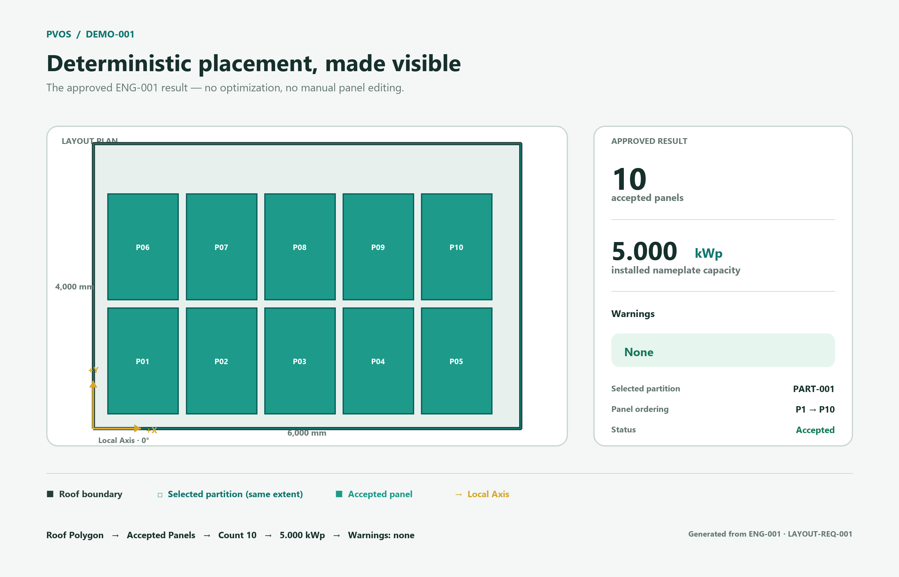

# DEMO-001 - First Visual Showcase

## Purpose

DEMO-001 presents the approved ENG-001 deterministic placement result in a form a non-developer can understand quickly. It changes no product, geometry, placement, ordering, statistic, warning, or specification behavior.



## Input

[`demo-input.json`](demo-input.json) is a static capture of the existing Demo-001 request: one `6000 x 4000 mm` rectangular roof, one selected partition with the same boundary, a Local Axis at `(0,0)` with `0°` rotation, and one `1000 x 1500 mm`, `500 Wp` module definition.

The JSON files are review artifacts, not a runtime JSON adapter or product API.

## Output

[`demo-output.json`](demo-output.json) is generated from the executable ENG-001 `LayoutResult`. It contains the exact ordered panel geometry, panel count, installed capacity, and warnings represented by the visual assets.

- [`demo-output.svg`](demo-output.svg) - accessible vector showcase
- [`demo-output.png`](demo-output.png) - captured screenshot of the same result
- [`demo-summary.md`](demo-summary.md) - concise review record

The roof, selected partition, and Local Axis context come from the immutable Demo-001 input. Every accepted panel, panel identifier, order, count, capacity value, and warning shown comes directly from the executable LayoutResult. No panel was manually added, moved, removed, or relabeled.

## How to run

From the repository root, execute the approved demo:

```powershell
dotnet run --project .\src\PVOS.Cli\PVOS.Cli.csproj --configuration Release
```

Compare the console result with [`demo-output.json`](demo-output.json) or the prior ENG-001 capture [`DEMO-001_OUTPUT.txt`](DEMO-001_OUTPUT.txt). The committed SVG and PNG are generated review artifacts; no UI framework or runtime rendering feature is added to PVOS.

## Expected result

| Result | Expected |
|---|---:|
| Placement status | `Accepted` |
| Accepted panels | `10` |
| Installed capacity | `5.000 kWp` |
| Placement warnings | `none` |
| Panel order | `PNL-000001` through `PNL-000010` |

## Captured screenshot

The PNG above is the captured screenshot. The SVG carries the same geometry and summary at scalable resolution.
